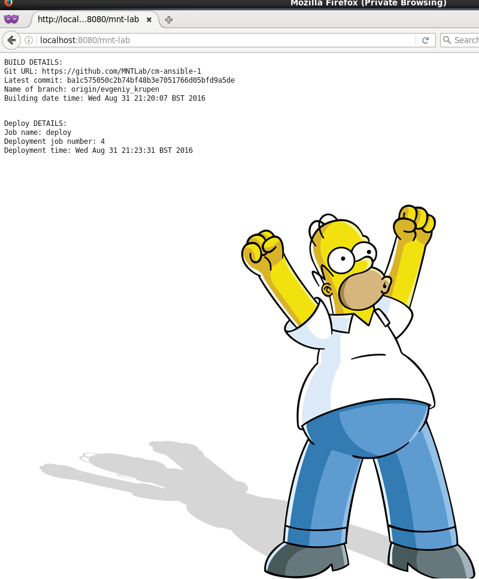

MTN.*NIX.11 Automated Environment Configuration Management
---

***Student***: [Evgeniy_Krupen](https://upsa.epam.com/workload/employeeView.do?employeeId=4060741400038655484#emplTab=general)

Ansible Home Task
------------------
Report
------------------
1. Nginx, Tomcat, Jenkins, Maven, Java were installed.
2. All configuration files were replaced by module template.
3. I changed ports in configuration files by vars (http_port: 9080, nginx_port: 8080).
4. Nginx, Tomcat, Jenkins were restarted by handlers.
5. I would be glad if you could check it :

[Ansible Provision File](vagrant/ansible/provision.yml)

- deploy application on tomcat

- delivery pipeline
                

Thank you for you attention.
I am looking forward to receiving your reply.
