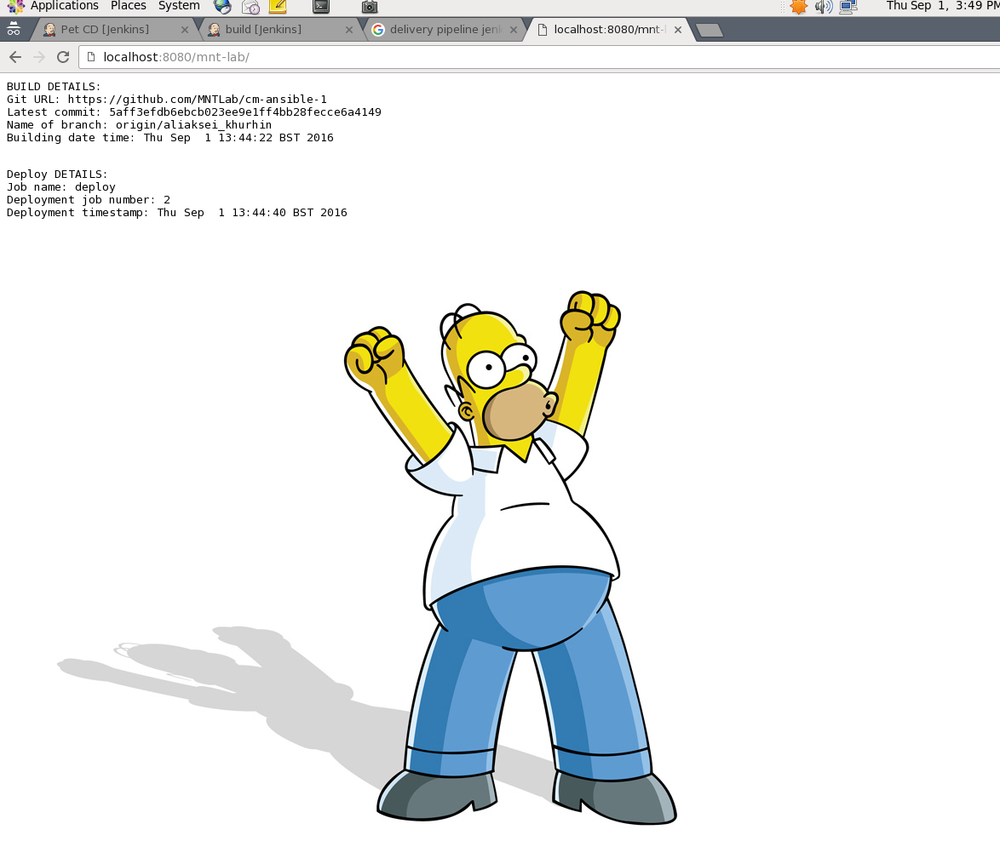

MTN.*NIX.11 Automated Environment Configuration Management
---

***Student***: [Aliaksei Khurhin](https://epa.ms/1Cqi0K)

Report
---
Next actions are made automatically by running "vagrant up" from vagrant dir:

- java 1.7.0, nginx, tomcat 7 and jenkins are installed
- configuration files are replaced by manually configured files
- jenkins plugins are placed by copy module
- jenkins jobs and maven config file are placed via copy module

[provision.yml](/vagrant/ansible/provision.yml)

